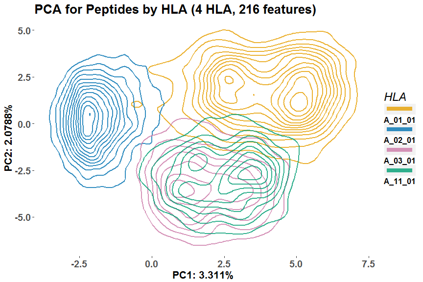

<!-- README.md is generated from README.Rmd. Please edit that file -->
PeptidePCA
==========

PeptidePCA contains a small suite of functions that can be used to recreate PCA figures from Hilton et al. (2017). HLA peptide sequences can be transformed into new features using an amino acid conversion matrix and then plotted using PCA. The packages ggplot2 and FactoMineR are required.

Installation
------------

You can install PeptidePCA in R with the following command

``` r
library(devtools)
devtools::install_github("ParhamLab/PeptidePCA")
```

Usage
-----

This is a small vignette to display what PeptidePCA can do

``` r
library(PeptidePCA)

## load in example datasets
# conversion matrix using 4 physicochemical properties and amino acid identities
data(convmat.24, package= "PeptidePCA")
colnames(convmat.24)
#>  [1] "Molecular weight"  "Surface area"      "Hydropathy index" 
#>  [4] "Isoelectric point" "Alanine"           "Arginine"         
#>  [7] "Asparagine"        "Aspartic acid"     "Cysteine"         
#> [10] "Glutamine"         "Glutamic Acid"     "Glycine"          
#> [13] "Histidine"         "Isoleucine"        "Leucine"          
#> [16] "Lysine"            "Methionine"        "Phenylalanine"    
#> [19] "Proline"           "Serine"            "Threonine"        
#> [22] "Tryptophan"        "Tyrosine"          "Valine"

## convert in ligand files (already done in this example)
# this is a folder that contains .txt files with one ligand per line and nothing else
# ligands.4A= read.ligands("C:/Users/Alex/Documents/PeptidePCA.testdata")

## load in the preconverted data for this example
data(ligands.4A, package= "PeptidePCA")
summary(ligands.4A)
#>         Length Class  Mode     
#> A_01_01 5753   -none- character
#> A_02_01 9969   -none- character
#> A_03_01 1667   -none- character
#> A_11_01  792   -none- character

# create features from example dataset
features.4A= conv.features.list(ligands.4A, convmat.24, 9)
#> [1] "A_01_01  feature conversion completed"
#> [1] "A_02_01  feature conversion completed"
#> [1] "A_03_01  feature conversion completed"
#> [1] "A_11_01  feature conversion completed"

# perform PCA
features.4A.pca= pep.pca(features.4A)

# colors for plotting, taken from http://jfly.iam.u-tokyo.ac.jp/color/
colors= c( "#E69F00", "#0072B2", "#CC79A7", "#009E73")

# plot PCA
pep.pca.plot(pca= features.4A.pca, type= "density", colors= colors)
```


